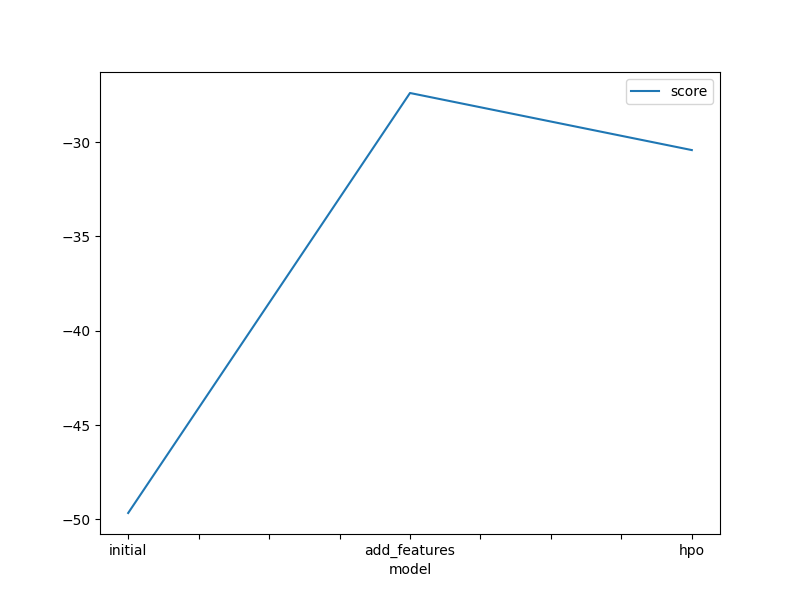
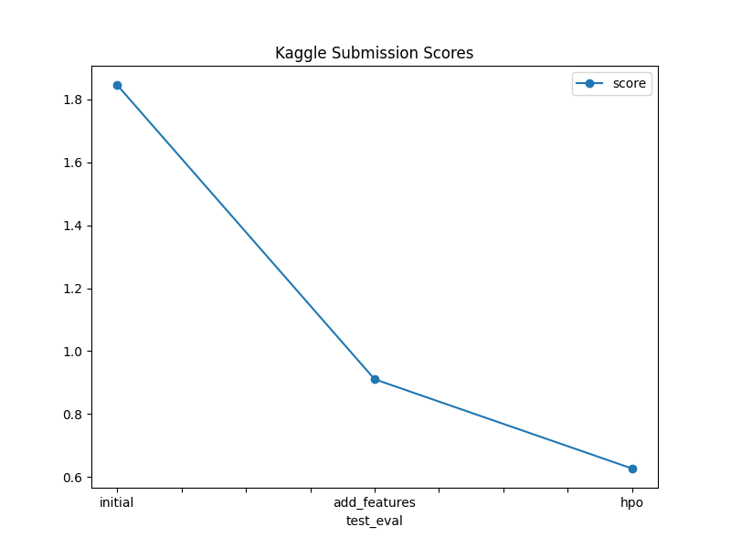

# Report: Predict Bike Sharing Demand with AutoGluon Solution
#### Millicent Auma Omondi

## Initial Training
### What did you realize when you tried to submit your predictions? What changes were needed to the output of the predictor to submit your results?
TODO: Add your explanation
To submit the results, we had to extract the target variable "count" column and then save it as a csv, that is, submission.csv

### What was the top ranked model that performed?
TODO: Add your explanation
From the Autogluon, the top ranked model that performed well was WeightedEnsemble_L3 

## Exploratory data analysis and feature creation
### What did the exploratory analysis find and how did you add additional features?
TODO: Add your explanation
It shows that the dataset has no missing values, the data types and how the data is distributed.
For the new features from the datetime column, we parsed the datetime strings into year, month and day

### How much better did your model preform after adding additional features and why do you think that is?
TODO: Add your explanation
The model's performance improved slightly. This was due to the additional features, year, month and day, adding more information to the model during training.

## Hyper parameter tuning
### How much better did your model preform after trying different hyper parameters?
TODO: Add your explanation
Tuning the hyperparameters improved the model's performance as the kaggle score values decreased. Initially it was 1.84630 and after hyperparameter tuning, it decreased to 0.62657.

### If you were given more time with this dataset, where do you think you would spend more time?
TODO: Add your explanation
Finetuning step: Experimenting with different hyperparameters 

### Create a table with the models you ran, the hyperparameters modified, and the kaggle score.
pd.DataFrame({
    "model": ["initial", "add_features", "hpo"],
    "hpo1": [None, None, "learning_rate"],
    "hpo2": [None, None, "max_depth"],
    "hpo3": [None, None, "model_type=['GBM','CAT','XGB']"], 
    "score": [1.84630 , 0.91047 , 0.62657]  
})
|model|hpo1|hpo2|hpo3|score|
|--|--|--|--|--|
|initial|None|None|learning_rate|1.84630|
|add_features|None|None|max_depth|0.91047|
|hpo|None|None|model_type=['GBM','CAT','XGB']|0.62657|

### Create a line plot showing the top model score for the three (or more) training runs during the project.

TODO: Replace the image below with your own.

### Create a line plot showing the top kaggle score for the three (or more) prediction submissions during the project.

TODO: Replace the image below with your own.

## Summary
TODO: Add your explanation
In this projectt we built and optimied a bike sharing demand model using Autogluon and submitted the results to kaggle.The best model was WeightedEnsemble_L3. By adding additional features like hour, day, month and year from the dataerime column, the model's performance improved as the kaggle score moved from 1.84630 to 0.91047. Hyperparameter tuning further enhanced the model's performance as it reduced to 0.62657.
